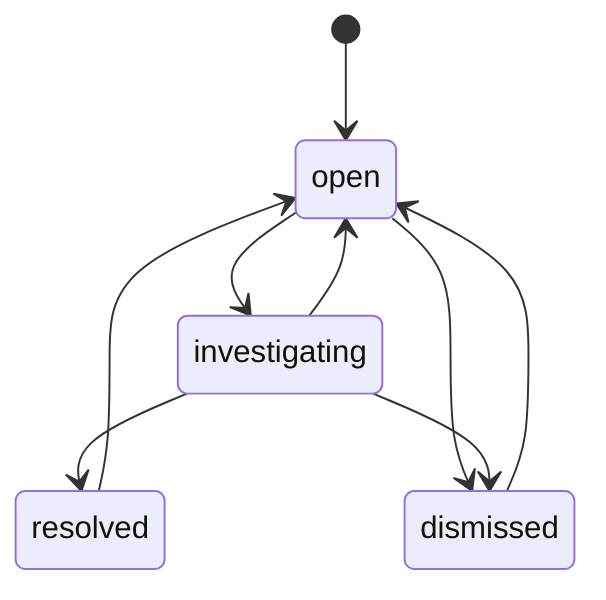

# Input contract

## Readings CSV

UTF-8 (optional BOM), comma-separated, exact ordered header:

```csv
meter_id,reading_date,counter_liters
M-0001,2026-08-30,543210
```

- `meter_id`: existing meter ID from the operational dimension.
- `reading_date`: canonical `YYYY-MM-DD`, no later than the submitted observation cutoff.
- `counter_liters`: ASCII nonnegative integer, at most 2,000,000,000. It is a cumulative counter, not the daily volume.
- Maximum 5 MiB per file and 100,000 parsed rows. Empty files fail.
- Daily cadence is an explicit assumption. Subdaily records, unit conversion, mixed time zones and meter rollover specifications are not supported.

The web upload cutoff cannot precede the latest stored reading. The demo baseline ends on 2026-08-29; the daily sample is 2026-08-30. Late-arriving observations can be imported with the current cutoff, but existing records are never overwritten.

## Ingestion outcomes

| Condition | Outcome |
|---|---|
| New valid meter/date | Accepted, with source-run ID |
| Same meter/date, same counter | Incoming duplicate quarantined |
| Same meter/date, different counter | Incoming conflict quarantined; original preserved |
| Unknown meter, invalid date, invalid counter, wrong row width | Row quarantined with reason and payload |
| Invalid header, invalid UTF-8, malformed CSV quoting, empty file, too many rows | Batch rolled back; failed run retained |
| Same bytes as a completed file, even under another filename | Original run returned; no new rows or cases |
| Same bytes as a failed file | Retry the atomic batch using its ledger ID |
| Same bytes as an active file | HTTP 409 for API upload; no misleading replay result |
| Running for more than one hour | Mark failed on startup or the next import, then allow retry |

Rejected count includes duplicate count. Acceptance rate = accepted / (accepted + rejected), across completed imports. Failed-file rows never enter that denominator.

The ledger is inserted before processing and completed in the same transaction as the readings, rejections and cases. A crash during that transaction rolls the batch back. Runs left `running` for over one hour are marked `failed` on API startup or the next import; retrying the same hash reuses its ledger ID. A successfully committed batch always replays without mutation. The ledger shows the latest attempt for each hash, so a failed attempt's prior error is replaced when retried. The `/api/ingestion/health` endpoint and pipeline page expose completed, failed and running counts, last successful import and latest reading date. Data age is reported as a fact about the **historical synthetic fixture**, not as a live utility-service SLA. The demo still assumes one ingestion writer across the API and CLI; file-level hash claims do not replace per-source orchestration.

## Reference entities

The deterministic generator provides customers, meters, one synthetic tariff and invoices. Meter/date uniqueness is enforced in the database. Foreign keys ensure readings, cases and invoices reference known meters. All customer names are `Synthetic site NNN`; no real customer records are included.

Tariff: €3.25 per m³ plus an €8.50 fixed fee per synthetic invoice period. These are illustrative values, not a published utility tariff. Invoices state their own volume. Billing validation checks arithmetic only.

## Event identity and operator decisions

Case identity is a stable SHA-256 prefix of meter ID, exception type and event start date. Re-evaluation can refresh supporting evidence, but preserves status and decision history. Earlier gap alerts remain historical events if backfilled later; the system does not silently close them. A reviewer decides their disposition.

Status transitions:



Every transition requires a nonblank note of 5–1,000 characters. Optimistic concurrency rejects stale revisions with HTTP 409. The actor is explicitly `Local demo operator`; it is not an authenticated identity.
