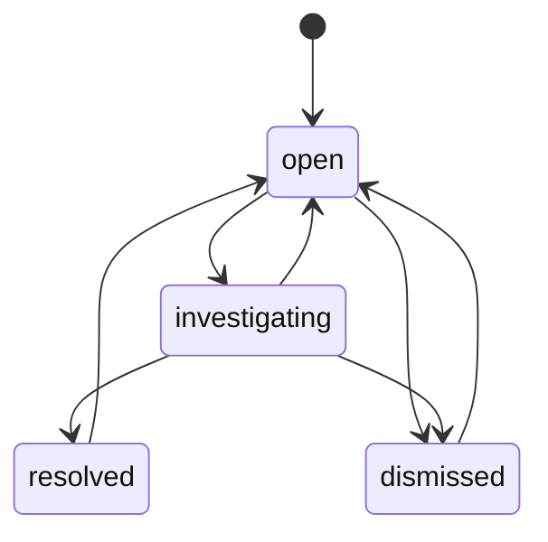

# Input contract

## Readings CSV

UTF-8 (optional BOM), comma-separated, exact ordered header:

```csv
meter_id,reading_date,counter_liters
M-0001,2026-08-30,543210
```

- `meter_id`: existing meter ID from the operational dimension.
- `reading_date`: canonical `YYYY-MM-DD`, no later than the submitted observation cutoff.
- `counter_liters`: ASCII nonnegative integer, at most 2,000,000,000. It is a cumulative counter, not the daily volume.
- Maximum 5 MiB per file and 100,000 parsed rows. Empty files fail.
- Daily cadence is an explicit assumption. Subdaily records, unit conversion, mixed time zones and meter rollover specifications are not supported.

The web upload cutoff cannot precede the latest stored reading. The demo baseline ends on 2026-08-29; the daily sample is 2026-08-30. Late-arriving observations can be imported with the current cutoff, but existing records are never overwritten.

## Ingestion outcomes

| Condition | Outcome |
|---|---|
| New valid meter/date | Accepted, with source-run ID |
| Same meter/date, same counter | Incoming duplicate quarantined |
| Same meter/date, different counter | Incoming conflict quarantined; original preserved |
| Unknown meter, invalid date, invalid counter, wrong row width | Row quarantined with reason and payload |
| Invalid header, invalid UTF-8, malformed CSV quoting, empty file, too many rows | Batch rolled back; failed run retained |
| Same file bytes, even under another filename | Original run returned; no new rows or cases |

Rejected count includes duplicate count. Acceptance rate = accepted / (accepted + rejected), across completed imports. Failed-file rows never enter that denominator.

The ledger is inserted before processing and completed afterward. A process crash can leave a `running` entry; automatic crash recovery is not implemented. Exact replays of failed or running hashes return their recorded state rather than retrying. Correct the file for a new hash or investigate the ledger through controlled maintenance. The demo runs one ingestion writer at a time; do not run simultaneous CLI imports and API imports.

## Reference entities

The deterministic generator provides customers, meters, one synthetic tariff and invoices. Meter/date uniqueness is enforced in the database. Foreign keys ensure readings, cases and invoices reference known meters. All customer names are `Synthetic site NNN`; no real customer records are included.

Tariff: €3.25 per m³ plus an €8.50 fixed fee per synthetic invoice period. These are illustrative values, not a published utility tariff. Invoices state their own volume. Billing validation checks arithmetic only.

## Event identity and operator decisions

Case identity is a stable SHA-256 prefix of meter ID, exception type and event start date. Re-evaluation can refresh supporting evidence, but preserves status and decision history. Earlier gap alerts remain historical events if backfilled later; the system does not silently close them. A reviewer decides their disposition.

Status transitions:



Every transition requires a nonblank note of 5–1,000 characters. Optimistic concurrency rejects stale revisions with HTTP 409. The actor is explicitly `Local demo operator`; it is not an authenticated identity.
